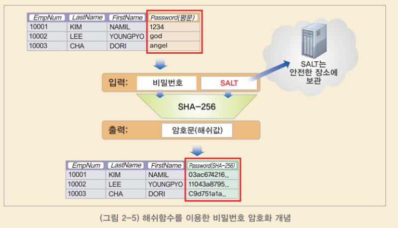
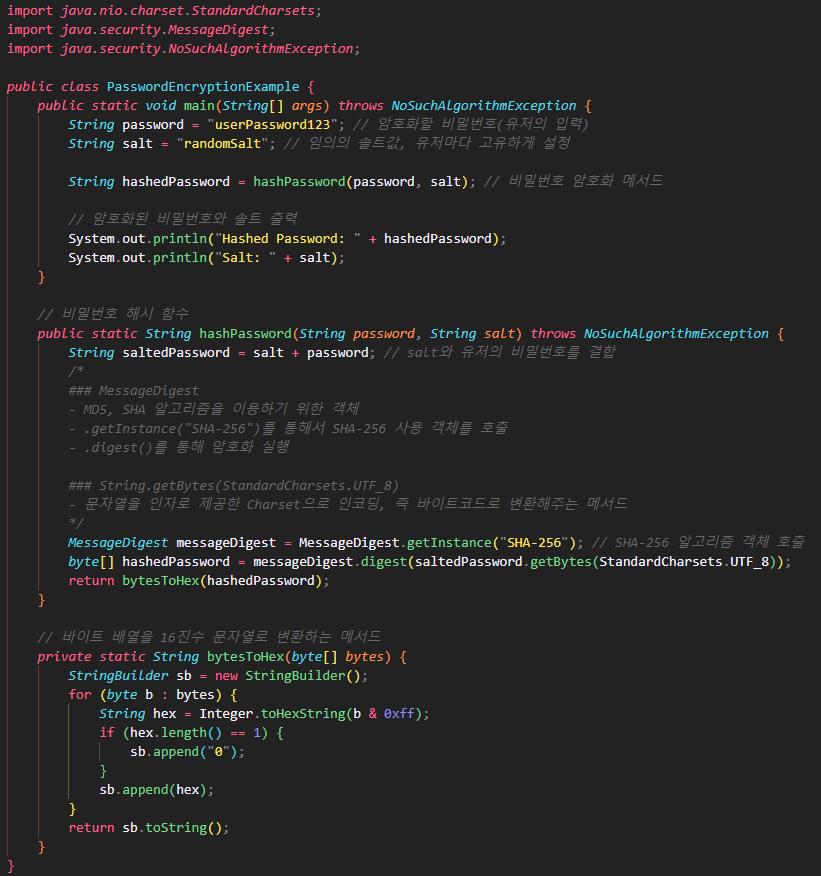
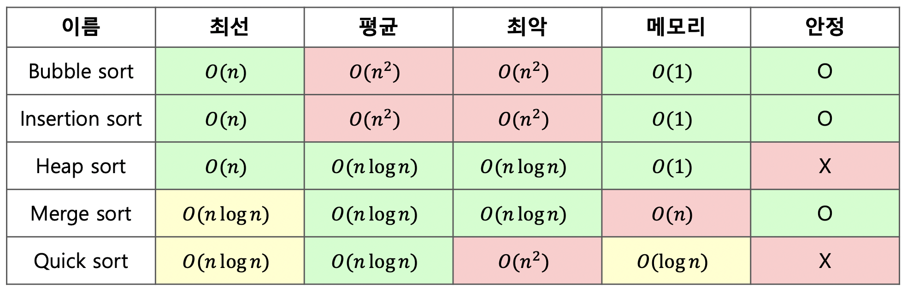

# 알고리즘 관통_기획서(서울14_배미혜,하정호)

# 구현요약

| 구현상세 | 구현 여부 | 테스트 통과 |
| --- | --- | --- |
| User 비밀번호 암호화 | O | O |
| 조횟수 기준 관광지 정보 정렬 | O | O |
| 관광지 이름 기준 관광지 정보 정렬 | O | O |
| 관광지 정보 기준 검색 | O | O |

# SHA-256

### **암호화 알고리즘**

- 암호화 알고리즘 개요
    - 유저 정보(예, 비밀번호)를 다룰 때, PlainText 그대로 클라이언트와 서버 혹은 서버 애플리케이션 내부에서 데이터를 주고받는 것은 보안상 위험하기 때문에 암호화를 해야한다. (현재는 선택이 아닌 필수로 암호화 해야한다.)
    - 다양한 암호화 알고리즘 중에서 Hashing을 사용하는 알고리즘을 사용할 예정이고, 그 중에서 좀 더 강도높은 암호화를 위해 salt를 사용하며 Hashing 알고리즘의 대표인 SHA-256을 사용할 것이다.
- SHA-256 알고리즘 설명
    - SHA(Secure Hash Algorithm)알고리즘 중 하나
    - 256비트로 구성되며 64자리 문자열을 반환
    - 레인보우 테이블의 위험을 대비하기 위해 salt라는 별도의 값을 추가하여 결과를 변형시키고 암호화한다.
    - salt는 랜덤하게 생성하되 유저마다 고유한 값을 갖도록 한다. (해당 유저 테이블에 같이 저장한다)
- 인증 과정
    
    
    

> 출처: 한국 인터넷 진흥원
> 
- 인증 과정
    - 유저의 첫 회원가입 시 정보를 암호화(hasing)한 후 DB에 저장
    - 이후 유저가 로그인할 때, 해당 정보를 암호화한 후 DB에 저장된 해싱값과 비교
    - 해싱값이 일치하면 인증 처리
- 구현 상세
    - 유저의 password에 암호화 적용 예정
        
        
        

# Sort

enum 객체를 이용해서 다양한 기준에 따라서 정렬 가능

- SortType.TITLE: 이름기준으로 정렬 → Guava 라이브러리 사용
- SortType.VIEW: 조횟수 기준으로 내림차순 정렬→ 팀소트와 Comparable 이용

```java
public List<Attraction> sort(List<Attraction>  attractions, SortType sortType){

        if(sortType.equals(SortType.TITLE)){ // 이름기준으로 정렬

            Collections.sort(attractions, (o1, o2) -> ComparisonChain.start()
                .compare(o1.getTitle(), o2.getTitle())
                .result());
            return attractions;
        }

        if(sortType.equals(SortType.VIEW)){ // 조횟수 기준으로 정렬
           Attraction[] sorted=attractions.toArray(new Attraction[attractions.size()]);
           timSort(sorted,attractions.size());
           return Arrays.asList(sorted);
        }

        return null;
    }
```

## Tim Sort

> 팀 소트는 작은 배열이나 이미 정렬된 배열을 다룰 때는 삽입 정렬(Insertion Sort)을 이용하며, 그 외의 경우에는 적절한 크기로 분할된 부분 배열을 병합 정렬(Merge Sort)로 정렬합니다. 팀 소트는 각각의 알고리즘의 장점을 살리면서도 단점을 보완하여, 안정적이면서도 빠른 정렬 알고리즘이다.
> 



### 구현

- **Attraction implements Comparable<Attraction>**

```java
@Override
    public int compareTo(Attraction o) {
        if(this.views < o.views) { // 내림차순 정렬을 위해서 view가 큰것을 작은 것으로
            return 1;
        }
        // 자기 자신의 views와 o의 views가 같다면 0
        else if(this.views == o.views) {
            return 0;
        }
        // 자기 자신의 views가 o의 views보다 크다면 음수
        else {
            return -1;
        }
    }
```

- AttractionServiceImpl

```java
static int MIN_MERGE = 32;

    public static int minRunLength(int n)
    {
        assert n >= 0;

        // Becomes 1 if any 1 bits are shifted off
        int r = 0;
        while (n >= MIN_MERGE)
        {
            r |= (n & 1);
            n >>= 1;
        }
        return n + r;
    }

    public static void insertionSort(Attraction[] arr, int left, int right)
    {
        for (int i = left + 1; i <= right; i++)
        {
            Attraction temp = arr[i];
            int j = i - 1;
            while (j >= left && arr[j].compareTo(temp) > 0)
            {
                arr[j + 1] = arr[j];
                j--;
            }
            arr[j + 1] = temp;
        }
    }

    public static void merge(Attraction[] arr, int l,
        int m, int r)
    {
        // 원래의 배열을 좌우 배열 두 가지로 나눈다.
        int len1 = m - l + 1, len2 = r - m;
        Attraction[] left = new Attraction[len1];
        Attraction[] right = new Attraction[len2];
        for (int x = 0; x < len1; x++)
        {
            left[x] = arr[l + x];
        }
        for (int x = 0; x < len2; x++)
        {
            right[x] = arr[m + 1 + x];
        }

        int i = 0;
        int j = 0;
        int k = l;

        // After comparing, we merge those two array
        // in larger sub array
        while (i < len1 && j < len2)
        {
            if (left[i].compareTo(right[j])<=0)
            {
                arr[k] = left[i];
                i++;
            }
            else {
                arr[k] = right[j];
                j++;
            }
            k++;
        }

        while (i < len1)
        {
            arr[k] = left[i];
            k++;

        while (j < len2)
        {
            arr[k] = right[j];
            k++;
            j++;
        }
    }

    public static void timSort(Attraction[] arr, int n)
    {
        int minRun = minRunLength(MIN_MERGE);

        for (int i = 0; i < n; i += minRun)
        {
            insertionSort(arr, i,
                Math.min((i + MIN_MERGE - 1), (n - 1)));
        }

        // Start merging from size
        for (int size = minRun; size < n; size = 2 * size)
        {

            for (int left = 0; left < n;
                left += 2 * size)
            {

                int mid = left + size - 1;
                int right = Math.min((left + 2 * size - 1),
                    (n - 1));

                if(mid < right)
                    merge(arr, left, mid, right);
            }
        }
    }
```

### 테스트

```java
@Test
    void attractionSortByViews() {
        init();
        attractions=service.sort(attractions,SortType.VIEW);

        for (int i = 1; i < attractions.size() ; i++) {
            assertEquals(attractions.size()-i-1,attractions.get(i).getViews());
        }
    }
```

## Sort Using Guava Lib

> **Google Guava란?**

Google Guava 는 Google이 GitHub에서 개발하는 Java 언어의 오픈 소스 라이브러리이다.

Google Guava는 문자열, 컬렉션, 캐시, 프리미티브 작업, 파일 작업, 어노테이션 등의 기능을 제공하며 Java 1.8 이상에서 사용할 수 있다.
> 

### 구현

```java
 Collections.sort(attractions, (o1, o2) -> ComparisonChain.start()
          .compare(o1.getTitle(), o2.getTitle())
          .result());
```

### 테스트

```java
@Test
    void attractionSortByTitle() {
        init();
        attractions=service.sort(attractions,SortType.TITLE);

        String[] sortedTitle= {
            "국립 청태산자연휴양림",
            "토함산자연휴양림",
            "비슬산자연휴양림",
            "불정자연휴양림",
            "청송 자연휴양림 퇴적암층 (청송 국가지질공원)",
            "국립 유명산자연휴양림",
            "국립 청옥산자연휴양림",
            "금원산자연휴양림",
            "국립 용대자연휴양림",
            "국립 가리왕산자연휴양림",
        };

       Arrays.sort(sortedTitle);

        for (int i = 0; i <attractions.size() ; i++) {
            assertEquals(sortedTitle[i],attractions.get(i).getTitle());
        }

    }
```

# Search

## KMP Algorithm

> Knuth-Morris-Pratt Algorithm
불일치가 발생한 텍스트 문자열의 앞 부분에 어떤 문자가 있는지를 미리 알고 있으므로, 불일치가 발생한 앞 부분에 대하여 다시 비교하지 않고 매칭을 수행
> 

패턴을 전처리하여 **부분일치 테이블 배열 pi[k]**을 구해서 잘못된 시작을 최소화함

- $pi[k]$ :처음부터 k인덱스까지를 끝으로 하는 부분 문자열에서 일치하는 접두사와 접미사가 일치하는 최대 길이


시간 복잡도 ⇒ $O(M+N)$

### 구현

```java
public List<Attraction> search(List<Attraction>  attractions, String searchWord) {

        //검색어를 기준으로 패턴생성
        char[] pattern = searchWord.toCharArray();
        int pLength = pattern.length;

        int[] pi = new int[pLength];
        
        //검색은 1번이므로 패턴 테이블은 1번만 생성
        for(int i=1, j=0; i<pLength; i++){
            while(j > 0 && pattern[i] != pattern[j]) j = pi[j-1];

            if(pattern[i] == pattern[j]) pi[i] = ++j;
            else pi[i] = 0;
        }

        // 필터링 결과 저장하는 배열
        List<Attraction>  filteredAttractions=new ArrayList<>();

        for (int k = 0; k < attractions.size() ; k++) {
            // 여행지 overview를 기준으로 text 검색
            char[] text = attractions.get(k).getOverview().toCharArray();
            int tLength = text.length;

            for(int i=0,j=0; i<tLength; ++i) {

                while(j>0 && text[i] != pattern[j]) j = pi[j-1];

                if(text[i] == pattern[j]) { //두 글자 일치
                    if(j == pLength-1) { // j가 패턴의 마지막 인덱스라면
                        filteredAttractions.add(attractions.get(i)); // 존재한다면 결과 리스트에 저장
                        break; // 존재 여부만 검사하므로 뒤쪽 볼 필요 없음
                    }else {
                        j++;
                    }
                }
            }

        }

        return filteredAttractions;

    }
```

### TEST

```java
// 테스트 통과
@Test
@DisplayName("검색결과가 1개인 경우 테스트")
	void searchOneResult() {
	    String keyword="삼국통일";
	    String[] searchResultTitle= {"토함산자연휴양림"};
	    List<Attraction> filtered=service.search(attractions,keyword);
	    for (int i = 0; i < attractions.size() ; i++) {
	        assertEquals(filtered.get(i).getTitle(),searchResultTitle[i]);
	    }
}

// 테스트 통과
@Test
@DisplayName("검색결과가 여러개인 경우 테스트")
	void searchMultipleResult() {
	    String keyword="자연";
	
	    String[] searchResultTitle= {
	        "국립 청태산자연휴양림",
	        "토함산자연휴양림",
	        "비슬산자연휴양림",
	        "불정자연휴양림",
	        "청송 자연휴양림 퇴적암층 (청송 국가지질공원)",
	        "국립 유명산자연휴양림",
	        "금원산자연휴양림",
	        "국립 용대자연휴양림",
	        "국립 가리왕산자연휴양림",};
	
	    List<Attraction> filtered=service.search(attractions,keyword);
	    for (int i = 0; i < attractions.size() ; i++) {
	        assertEquals(filtered.get(i).getTitle(),searchResultTitle[i]);
	    }
	
	
}
```